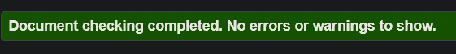
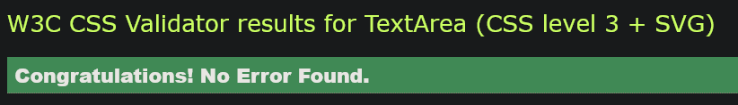
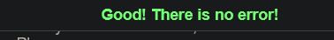
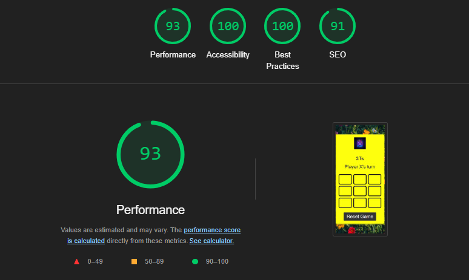

# TTT's
Welcome to [ TTT's ](https://paula2416.github.io/TTT-s/), the digital version of X and O where we play on a 3x3 grid. TTTs is built with simple controls and captivating graphics that form a flexible experience, where you against another person.
![TTT]
 
# Existing Features
### The TTT'S and Heading
   Featured at the top of the page, the TTT'S and heading is easy to see for the user. Upon viewing the page, the user will be able to see the name of the game.
   

### Game Status 
This area displays the current player in line, providing real-time updates on whose turn is next in the game session.

### Game board
The TTT's game board is a 3x3 grid where players alternate placing their symbols with the computer. The board visually updates after each move, checking for winning combinations or ties, and highlights the winner or indicates a draw when the game ends in the game status .

### Validator Testing

*  HTML

No errors were returned when passing through the official W3C validator

*  CSS

 No errors were found when passing through the official (Jigsaw) validator
 

* JavaScript

  No errors were found when passing through the official Jshint validator
  

* Performace

i also identified that my colors and fonts for all pages are well accessed by running each page in the light house. 

            
Unfixed Bugs
there were no unfixedbugs but i changes my javascript to allow the player to play with the computer as said by my Tutor

### Deployment

* This is the  process i went through to deploy the project to a hosting platform Github . The site was deployed to GitHub pages. The steps to deploy are as follows:

 In the GitHub repository, i navigated to the Settings tab
From the source section drop-down menu, selected the Master Branch
Once the master branch has been selected, the page will be automatically refreshed with a detailed ribbon display to indicate the successful deployment.

The live link can be found here - https://paula2416.github.io/TTT-s/

* Media

    The photos used were picked from pinterest

### Functional Testing
| Action              |Expected  Behaviour    | Pass/Fail|
| --------------------| ----------------------| ---------|
|Open URL link        | Loads the game        |  Pass    |  
|Tap any tile to play | player X appears      | Pass     |
|Tap the reset button | restarts the game     |  Pass    |

### Testing

* i tested this page and it works in the different websites that is to say :Chrome ,Safari , Google and Firebox .
* i tested this website and i confirmed that i is responsive and looks good on all sizes and platforms.
* i tested all the tiles and confirmed that they work and players can enjoy the game .

Thank you very much 