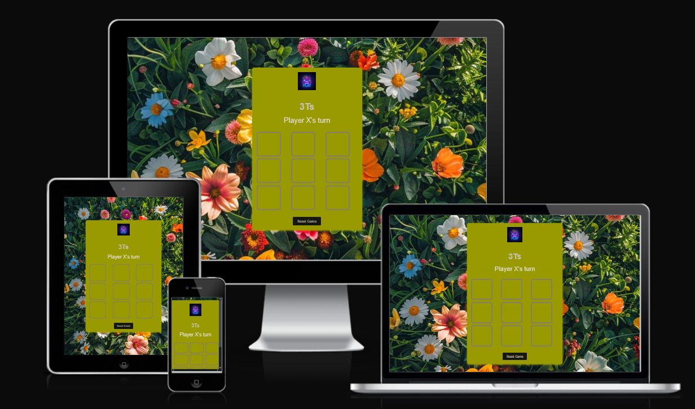
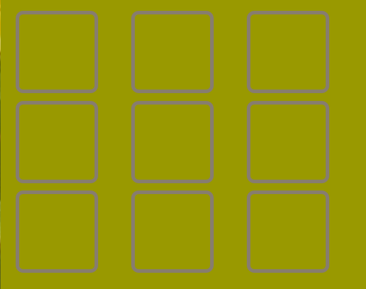

# TTT's
Welcome to **TTTs (Tic-Tac-Toe)**, the digital version of X and O where we play on a 3x3 grid. TTTs is built with simple controls and captivating graphics that form a flexible experience, where you against another person.
![TTT]
 
# Existing Features
### The TTT'S and Heading
   Featured at the top of the page, the TTT'S and heading is easy to see for the user. Upon viewing the page, the user will be able to see the name of the game.
   

### Game Status 
This area displays the current player in line, providing real-time updates on whose turn is next in the game session.

### Game board
The TTT's game board is a 3x3 grid where players alternate placing their symbols with the computer. The board visually updates after each move, checking for winning combinations or ties, and highlights the winner or indicates a draw when the game ends in the game status .

Testing

In this section, you need to convince the assessor that you have conducted enough testing to legitimately believe that the site works well. Essentially, in this part you will want to go over all of your project’s features and ensure that they all work as intended, with the project providing an easy and straightforward way for the users to achieve their goals.

In addition, you should mention in this section how your project looks and works on different browsers and screen sizes.

You should also mention in this section any interesting bugs or problems you discovered during your testing, even if you haven't addressed them yet.

If this section grows too long, you may want to split it off into a separate file and link to it from here.
Validator Testing

    HTML
        No errors were returned when passing through the official W3C validator
    CSS
        No errors were found when passing through the official (Jigsaw) validator
    JavaScript
        No errors were found when passing through the official Jshint validator
            The following metrics were returned:
            There are 11 functions in this file.
            Function with the largest signature takes 2 arguments, while the median is 0.
            Largest function has 10 statements in it, while the median is 3.
            The most complex function has a cyclomatic complexity value of 4 while the median is 2.

Unfixed Bugs

You will need to mention unfixed bugs and why they were not fixed. This section should include shortcomings of the frameworks or technologies used. Although time can be a big variable to consider, paucity of time and difficulty understanding implementation is not a valid reason to leave bugs unfixed.
Deployment

This section should describe the process you went through to deploy the project to a hosting platform (e.g. GitHub)

    The site was deployed to GitHub pages. The steps to deploy are as follows:
        In the GitHub repository, navigate to the Settings tab
        From the source section drop-down menu, select the Master Branch
        Once the master branch has been selected, the page will be automatically refreshed with a detailed ribbon display to indicate the successful deployment.

The live link can be found here - https://code-institute-org.github.io/love-maths/
Credits

In this section you need to reference where you got your content, media and extra help from. It is common practice to use code from other repositories and tutorials, however, it is important to be very specific about these sources to avoid plagiarism.

You can break the credits section up into Content and Media, depending on what you have included in your project.
Content

    The text for the Home page was taken from Wikipedia Article A
    Instructions on how to implement form validation on the Sign Up page was taken from Specific YouTube Tutorial
    The icons in the footer were taken from Font Awesome

Media

    The photos used on the home and sign up page are from This Open Source site
    The images used for the gallery page were taken from this other open source site

Congratulations on completing your Readme, you have made another big stride in the direction of being a developer!
Other General Project Advice

Below you will find a couple of extra tips that may be helpful when completing your project. Remember that each of these projects will become part of your final portfolio so it’s important to allow enough time to showcase your best work!

    One of the most basic elements of keeping a healthy commit history is with the commit message. When getting started with your project, read through this article by Chris Beams on How to Write a Git Commit Message
        Make sure to keep the messages in the imperative mood

    When naming the files in your project directory, make sure to consider meaningful naming of files, point to specific names and sections of content.
        For example, instead of naming an image used ‘image1.png’ consider naming it ‘landing_page_img.png’. This will ensure that there are clear file paths kept.

    Do some extra research on good and bad coding practices, there are a handful of useful articles to read, consider reviewing the following list when getting started:
        Writing Your Best Code
        HTML & CSS Coding Best Practices
        Google HTML/CSS Style Guide

Getting started with your Portfolio Projects can be daunting, planning your project can make it a lot easier to tackle, take small steps to reach the final outcome and enjoy the process!
# Testing 
# Validator testing 
# Deployment
